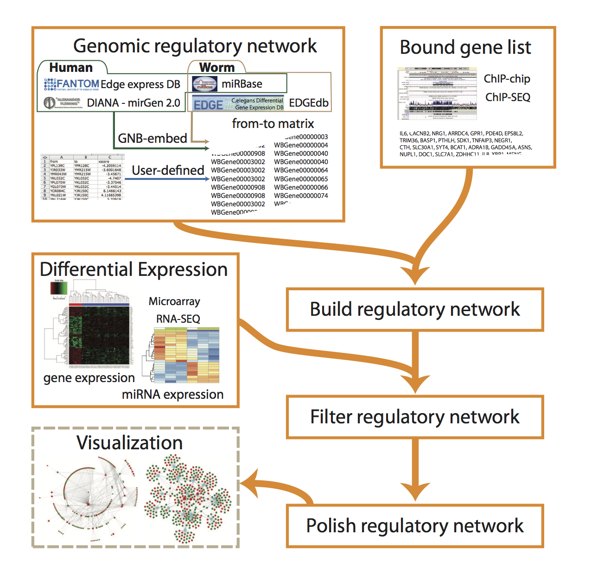

```{r, echo=FALSE, results="hide", warning=FALSE}
suppressPackageStartupMessages({
  library(GeneNetworkBuilder)
  library(Rgraphviz)
  library(XML)
  library(RCyjs)
})
knitr::opts_chunk$set(warning=FALSE, message=FALSE)
```

# Introduction
Transcription factors (TFs), chromatin modifications and microRNAs (miRNAs) are  
important in regulating gene expression[@Walhout2010]. 
Chromatin immunoprecipitation (ChIP) followed by
high-throughput sequencing (ChIP-seq)[@Peter2009] or genome tiling
array analysis (ChIP-chip)[@Tae2006] are widely used 
technologies for identifying genome-wide binding sites of TFs (TFBDs)[@Kerstin2010]. 
The role of the TF on genome-wide gene expression can be
determined by expression microarray or RNA-seq experiments[@Zhong2009].  By combining
both technologies, researchers have the potential to decipher the regulatory
network of the TF. Genes bound by the TF and altered in expression are
considered direct targets of the TF, and genes altered in expression but not
bound by the TF are the indirect targets of the TF. The indirect targets can
potentially form a complex network itself, especially when the TF is a
master regulator who regulates other TFs. To facilitate identification of
the complex regulatory network of TFs and how indirect targets are
inter-connected, we have developed GeneNetworkBuilder (GNB). Each genereated
network is consisted of a directed acyclic graph with each edge representing
TF -> gene, TF -> miRNA, or miRNA -> gene where a -> b represents "a
regulates b". 

# Examples of using GeneNetworkBuilder
To use GNB, users need to input a list of genes bound by a given
TF and another list of genes/miRNAs with altered expression by knockdown/knockout of the
same TF. The bound gene list could be obtained from ChIP-seq or ChIP-chip
experiment. The gene list with altered expression are from RNA-seq or
expression microarray experiment.  ChIP experiments and expression
experiments should preferably be performed in similar experimental condition
such as tissue type, development stage etc.  In addition, users need to
select a TF regulatory network from GNB or upload customized TF regulatory
network.

GNB provides two embedded regulatory networks. One is designed for _Caenorhabditis elegans_
combining database EDGEdb[@Barrasa2007] and microCosm Targets[@Sam2008]. Database
MicroCosm Targets contains computationally predicted targets for miRNAs
across many species. EDGEdb contains experimentally determined interactions
of ~934 worm TFs by high-throughput yeast on-hybrid (Y1H) assay. And the
other embedded regulatory network is designed for _Homo sapiens_ combining database FANTOM[@Ravasi2010],
miRGen[@Panagiotis2010] and microCosm Targets[@Sam2008]. FANTOM stores physical
interactions among the majority of human/mouse DNA-binding TFs. The miRGen
is an integrated database of miRNA regulation by TFs and miRNA targets mainly for human. 

Figure 1 depicts the relationships of various databases and
its role in GNB.



# Quick start
Here is an example to use GNB to generate a simple regulatory network for _C. elegans_.
There are three steps, 
1. buildNetwork, build the network by GNB-embedded or user-defined regulatory network 
starting from the bound gene list.
2. filterNetwork, filter the network by differential expressed genes/miRNAs. 
3. polishNetwork, generate the graphNEL object with display style.

```{r quickStart}
library(GeneNetworkBuilder)
##load C. elegans miRNA ID lists
data("ce.miRNA.map")
##load GNB-embedded regulatory network of C. elegans.
data("ce.interactionmap")
##load data required
data("example.data")
##build the network by binding list and interaction map
sifNetwork<-buildNetwork(TFbindingTable=example.data$ce.bind, 
                        interactionmap=ce.interactionmap, level=2)
##filter the network by expression data
cifNetwork<-filterNetwork(rootgene="WBGene00000912", sifNetwork=sifNetwork, 
                    exprsData=uniqueExprsData(example.data$ce.exprData), 
                    mergeBy="symbols",
                    miRNAlist=as.character(ce.miRNA.map[ , 1]), 
                    remove_miRNA=FALSE, tolerance=1)
##generate graphNEL object for the network
gR<-polishNetwork(cifNetwork=cifNetwork, nodecolor=colorRampPalette(c("green", "yellow", "red"))(5))
browseNetwork(gR)
```

# Example using gene expression profile
Here is an example to use GNB to generate a simple regulatory network for 
_C. elegans_. And also show some examples how to use the `graphNEL` object 
for further analysis.

```{r ce_example}
library(GeneNetworkBuilder)
data("example.data")
##Initialize a binding matrix by TF and the related gene lists of TFBDs.
##For example, TF is daf-16, and the ChIP-chip result indicates that it can bind to 
##upstream regions of gene "zip-2", "zip-4", "nhr-3" and "nhr-66".
bind<-cbind(from="daf-16", to=c("zip-2", "zip-4", "nhr-3", "nhr-66"))
##For same gene, there are multple gene alias. In order to eliminate the possibility of 
##missing any interactions, convert the gene symbols to unique gene ids is important.
data("ce.IDsMap")
bind<-convertID(toupper(bind), IDsMap=ce.IDsMap, ByName=c("from", "to"))
##build the network by binding list and interaction map
data("ce.interactionmap")
sifNetwork<-buildNetwork(TFbindingTable=example.data$ce.bind, 
                        interactionmap=ce.interactionmap, level=2)
##filter the network by expression data
##For each gene id, it should have only single record for expression change.
unique.ce.microarrayData<-uniqueExprsData(example.data$ce.exprData,
                        method="Max", condenseName='logFC')
data("ce.miRNA.map")
cifNetwork<-filterNetwork(rootgene="WBGene00000912", sifNetwork=sifNetwork, 
                    exprsData=unique.ce.microarrayData, mergeBy="symbols",
                    miRNAlist=as.character(ce.miRNA.map[ , 1]), 
                    tolerance=1, cutoffPVal=0.01, cutoffLFC=1)
##convert the unique gene ids back to gene symbols
data("ce.mapIDs")
cifNetwork<-convertID(cifNetwork, ce.mapIDs, ByName=c("from","to"))
##generate graphNEL object for the network
gR<-polishNetwork(cifNetwork, nodecolor=colorRampPalette(c("green", "yellow", "red"))(10))
##plot the figure
browseNetwork(gR)
## or plot by Rgraphviz
library(Rgraphviz)
plotNetwork<-function(gR, layouttype="dot", ...){
    if(!is(gR,"graphNEL")) stop("gR must be a graphNEL object")
    if(!(GeneNetworkBuilder:::inList(layouttype, c("dot", "neato", "twopi", "circo", "fdp")))){
        stop("layouttype must be dot, neato, twopi, circo or fdp")
    }
    g1<-Rgraphviz::layoutGraph(gR, layoutType=layouttype, ...)
    nodeRenderInfo(g1)$col <- nodeRenderInfo(gR)$col
    nodeRenderInfo(g1)$fill <- nodeRenderInfo(gR)$fill
    renderGraph(g1)
}
plotNetwork(gR)
##output the GXL file
library("XML")
xml<-saveXML(toGXL(gR)$value())
z<-textConnection(xml)
cat(readLines(z, 8), sep="\n")
##calculate shortest path, ...
library(RBGL)
sp.between(gR,"daf-16","lam-2")

```

# Example using both gene and miRNA expression profile
Using several advanced genomic technologies including micorarray profiling and miRNA sequencing, 
not only the gene expression profile, but also the miRNA expression profile can be obtained.
A more robust network can be built if miRNA expression profiling is available. Here is an example to build *SOX2* response 
network for _H. sapiens_. The data was downloaded from [BMC Genomics](http://www.ncbi.nlm.nih.gov/pmc/articles/PMC3022822/?tool=pubmed)[@xuefeng2011].

```{r hs_example}
library(GeneNetworkBuilder)
data("hs.interactionmap")
data("hs.miRNA.map")
data("hs.IDsMap")
data("hs.mapIDs")
data("example.data")
rootgene<-"6657"
sifNetwork<-buildNetwork(example.data$hs.bind, hs.interactionmap, level=3)
##example.data$ce$exprData is the combination of gene/miRNA expression profile
##note, here should set the miRNAtol to TRUE
cifNetwork<-filterNetwork(rootgene=rootgene, sifNetwork=sifNetwork, 
                   exprsData=example.data$hs.exprData, mergeBy="symbols", 
                   miRNAlist=as.character(hs.miRNA.map[,1]),
                   tolerance=0, miRNAtol=TRUE)
cifNetwork<-convertID(cifNetwork, hs.mapIDs, ByName=c("from","to"))
gR<-polishNetwork(cifNetwork)
##plot the figure
browseNetwork(gR)
## or plot by Rcyjs
# library(RCyjs)
# rcy <- RCyjs(portRange=9047:9067, title='sox2', graph=gR)
# setBrowserWindowTitle(rcy, "sox2")
# setNodeLabelRule(rcy, "label")
# setNodeLabelAlignment(rcy, "center", "center")
# setDefaultNodeColor(rcy, "white")
# setDefaultNodeBorderColor(rcy, "black")
# setDefaultNodeBorderWidth(rcy, 1)
# logFC.range <- range(cifNetwork$logFC)
# logFC.range <- max(abs(logFC.range))
# setNodeColorRule(rcy, "logFC", c(-logFC.range, 0, logFC.range), c("green", "yellow", "red"), mode="interpolate")
# size.range <- range(noa(gR, "size"))
# setNodeSizeRule(rcy, "size", size.range, size.range)
# layout(rcy, "cose")
# redraw(rcy)
```

# Session Info
```{r sessionInfo}
sessionInfo()
```

# References
